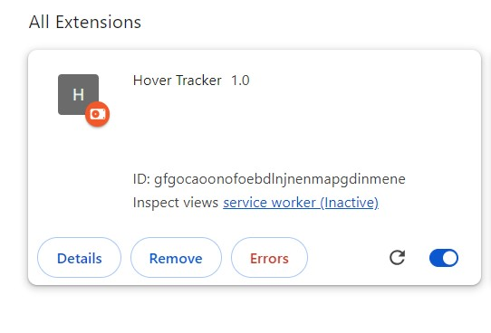
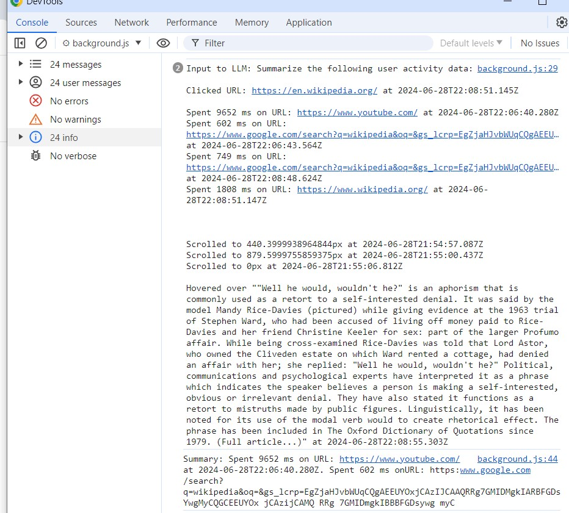
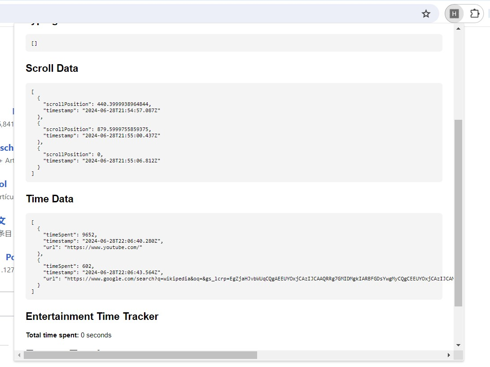

# Chrome Extension USER_DATA

## Overview

This Chrome extension collects user interaction data from web pages, including mouse hover, clicked links, hover data, typed text, and time spent on websites. Additionally, it features summary generation using a free Large Language Model (LLM), "mixtral-8x7b-32768" using GroqCloud. The extension also provides real-time data in a popup and allows the activity to be downloaded in CSV format.

## Features

1. **Data Collection**:
   - Mouse Hover
   - Clicked Links
   - Hover Data
   - Typed Text
   - Time Spent on Websites
   - focused data location 

2. **Real-Time Data Display**:
   - Data displayed in a popup, refreshed every minute.

3. **Focused Text Detection**:
   - Identifies the text the user is focused on, along with its position on the webpage.

4. **Text Summary**:
   - Click on the service worker to view the summary in the console using the LLM model: "mixtral-8x7b-32768".
   Step 1 : Click on the *service-worker* 
   Step 2 : You can get a summary of the acivity.  

5. **Real-Time Data Popup**:
   - Click on the extension icon to generate a popup displaying real-time data.
   

6. **CSV Download**:
   - Download the user's activity data in CSV format.

